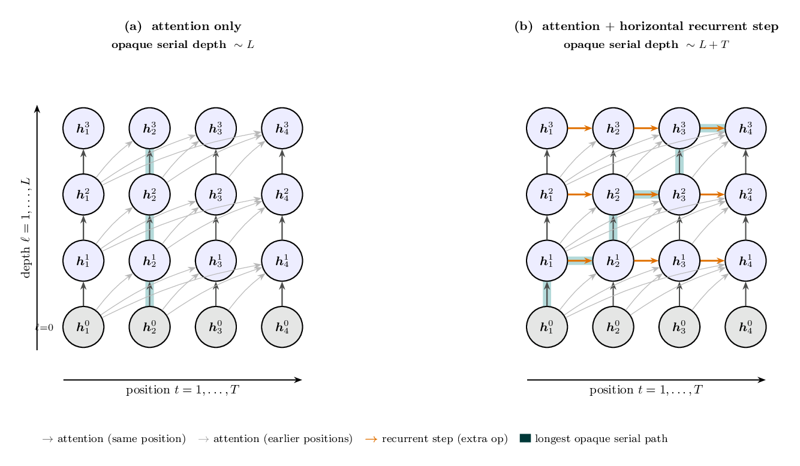

In a [recent 80,000 Hours podcast](https://80000hours.org/podcast/episodes/rohin-shah-google-deepmind-agi-safety/),
Rohin Shah (Google DeepMind) describes why today's models are **"wide but shallow"**:
current hardware lets them do an enormous amount of work *in parallel*, but only a
limited number of *sequential* steps within a single forward pass. Reasoning that
needs more serial steps has to spill out into the chain of thought — tokens a human
can read.

He and colleagues make this precise in [*Quantifying the Necessity of Chain of Thought
through Opaque Serial Depth*](https://arxiv.org/abs/2603.09786) (Brown-Cohen, Lindner
& Shah, 2026). The **opaque serial depth** is

> the length of the longest computation that can be done without the use of
> interpretable intermediate steps like chain of thought.

In residual-stream terms: the longest chain of dependencies you can trace through the
network *between* legible token-bottlenecks. The figure traces that longest chain
(highlighted) for two architectures.



Notation: residual stream $\boldsymbol h^{\ell}_{t}$, depth $\ell = 1,\dots,L$
(bottom→top, with $\ell = 0$ the token embeddings), positions $t = 1,\dots,T$
(left→right).

## (a) Attention only — depth $\sim L$

Causal attention lets $\boldsymbol h^{\ell}_{t}$ read *every* earlier position
$\{\boldsymbol h^{\ell-1}_{t'} : t' \le t\}$ of the layer below **in parallel** — a
single attention operation, a weighted sum over $t'$. No position has to wait for
another position to finish, so the only genuinely *serial* thing is climbing the $L$
layers. The longest opaque chain is just the vertical
$\boldsymbol h^{0}_{t} \to \boldsymbol h^{1}_{t} \to \dots \to \boldsymbol h^{L}_{t}$,
of length $\sim L$. (Each layer adds a little fan-in depth for the softmax over $T$
keys, giving $\mathcal{O}\!\big(L(\log T + \log D)\big)$ overall.)

```text
Algorithm (a): standard transformer layer            # opaque serial depth ~ L
for l = 1 … L:                          # L serial layers
    for t = 1 … T   (in parallel):      # every position at once
        q, k, v = W_Q h^{l-1}_t , W_K h^{l-1}_t , W_V h^{l-1}_t
        a^l_t   = sum_{t' <= t}  softmax_{t'}( q·k_{t'} / sqrt(d) ) · v_{t'}   # attend DOWN to layer l-1
        h^l_t   = h^{l-1}_t + a^l_t                                           # residual
# longest serial chain:   h^l_t <- h^{l-1}_t <- … <- h^0_t      =>   ~ L steps
```

## (b) Add a horizontal recurrent step — depth $\sim L+T$

Now give the attention block **one extra operation**: besides reading the layer below,
each position also reads the *same layer's previous position*
$\boldsymbol h^{\ell}_{t-1}$ (the orange arrows). Positions can no longer be computed
all at once — $\boldsymbol h^{\ell}_{t}$ depends on $\boldsymbol h^{\ell}_{t-1}$, so the
layer must run **sequentially in $t$**. The longest opaque chain can now zig-zag:
up a layer, across a token, up a layer, … using up to $L$ vertical steps **and** $T$
horizontal ones, for depth $\sim L+T$ ($\mathcal{O}\!\big((L+T)\log D\big)$). Far more
hidden serial reasoning can happen before anything has to surface as a token.

```text
Algorithm (b): + horizontal recurrence                # opaque serial depth ~ L + T
for l = 1 … L:
    for t = 1 … T   (now SEQUENTIAL in t):
        q, k, v = W_Q h^{l-1}_t , W_K h^{l-1}_t , W_V h^{l-1}_t
        a^l_t   = sum_{t' <= t}  softmax_{t'}( q·k_{t'} / sqrt(d) ) · v_{t'}  # attend DOWN to layer l-1
        r^l_t   = g( h^l_{t-1} , h^{l-1}_t )        # <-- EXTRA horizontal op: same layer, previous position
        h^l_t   = h^{l-1}_t + a^l_t + r^l_t                                   # residual
# now h^l_t depends on h^l_{t-1}  =>  the longest chain zig-zags ↑ and →   =>   ~ L + T steps
```

Why it matters for oversight: the larger a model's opaque serial depth, the more
reasoning it can carry out inside one forward pass instead of writing it down. The
paper computes upper bounds for Gemma 3 and argues opaque serial depth could become an
architecture-level governance knob — e.g. Mixture-of-Experts models appear to have
*lower* opaque depth than comparable dense models.

---

*Sources: [Rohin Shah — 80,000 Hours podcast](https://80000hours.org/podcast/episodes/rohin-shah-google-deepmind-agi-safety/)
· [Quantifying the Necessity of Chain of Thought through Opaque Serial Depth, arXiv:2603.09786](https://arxiv.org/abs/2603.09786).
Figure: [PDF](opaque_serial_depth.pdf) · [TikZ source](opaque_serial_depth.tex). The
horizontal-recurrence variant drawn here is a simplified illustration; the paper's
$L+T$ result is derived for replacing attention with RNN blocks.*
