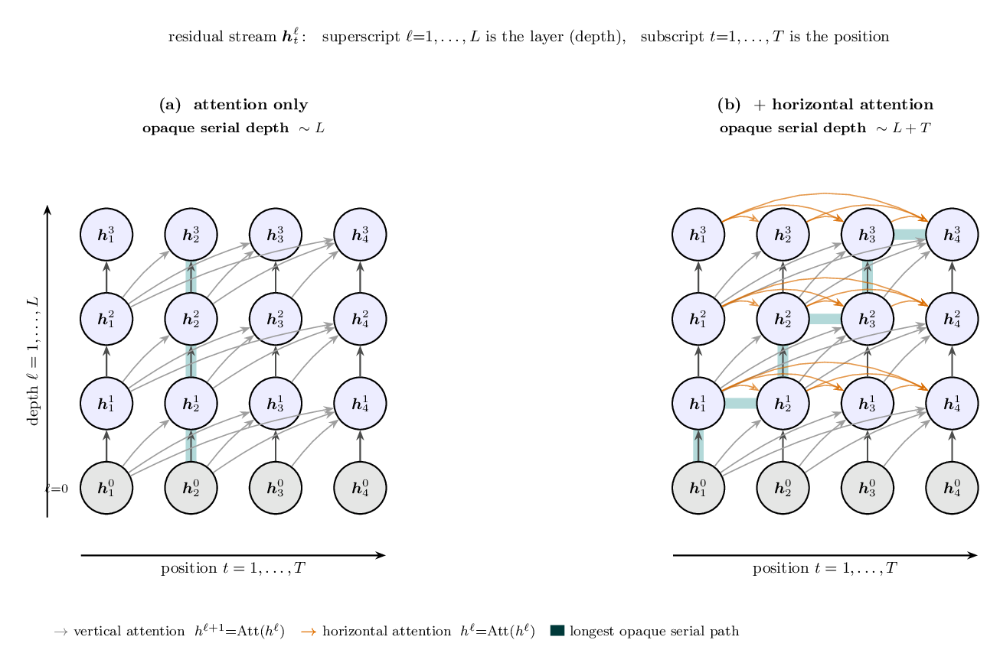

> **TL;DR.** A transformer's opaque serial depth scales with its number of layers, $\sim L$ (up to log factors).
> Any longer serial computation has to go through the tokens it writes. For illustration, I
> briefly discuss a subtly different, *hypothetical* kind of attention that reads the layer
> it is writing. That variant would have greater opaque serial depth, $\sim L+T$.

On the [80,000 Hours podcast](https://80000hours.org/podcast/episodes/rohin-shah-google-deepmind-agi-safety/),
Rohin Shah describes today's transformers as **wide but shallow**. A single forward pass
does an enormous amount of work in parallel, but only a handful of steps in sequence.
Reasoning that needs a longer chain has to spill into the chain of thought, where it can be
read. That is a big part of why he is cautiously optimistic about chain-of-thought
monitoring. In [a paper with Jonah Brown-Cohen and David Lindner](https://arxiv.org/abs/2603.09786),
he makes the intuition precise as **opaque serial depth**: the longest computation a model
can do without interpretable intermediate steps.

**Definition.** Depth is *circuit depth*, the longest path through a circuit of binary
associative ops and piecewise-analytic scalar functions. It is minimised over
polynomial-size circuits, and in practice upper-bounded. A sum over $n$ inputs costs
$\log_2 n$. Tokens (input, output, chain of thought) count as interpretable, and only paths
between them count.

**Steps vs. logs.** It helps to split depth into two parts: how many *steps* an opaque path
takes (one per layer up, or one per position to the right), and what each step costs. A step
contains sums over $D$ features, and in attention also over up to $T$ positions, so it costs
$O(\log D)$ or $O(\log T + \log D)$. Below, $\sim$ counts steps, and the $O(\cdot)$ formulas
are the paper's full circuit depths. What matters is whether $T$ shows up only *inside a log*
or *linearly*.



**Transformer (a).** An opaque path through the residual stream $\boldsymbol h^\ell_t$ can only go up
or right. Every attention edge also climbs a layer, so a path has at most $L$ steps, each
costing $O(\log T + \log D)$:

$$\text{depth} = O\big(L(\log T + \log D)\big).$$

So a longer context barely helps. The only edge back down to layer 0 runs through a
sampled token. Hence **any computation in (a) that needs more serial depth than one
forward pass provides ($\sim L$ layers) must be exposed in the emitted tokens (though it
might be obfuscated)**. Those tokens may be compressed or steganographic, but they travel
through a channel we can see.

**Recurrence (b).** Let position $t$ read earlier positions *within* its own layer. Now a
path can take $L$ steps up *and* $T$ steps right, $\sim L+T$ steps in total. The paper
analyses RNN blocks, where each right step reads only $t-1$ and costs $O(\log D)$:

$$\text{depth}_{\text{RNN}} = O\big((L+T)\log D\big).$$

Panel (b) and the code below use a hypothetical same-layer *attention* instead. Each of its
steps still sums over up to $T$ positions, so its depth is $O\big((L+T)(\log T+\log D)\big)$.
Either way, $T$ now enters linearly.

In code, take causal *linear* attention (no softmax),
$\mathrm{Att}(\boldsymbol h)_t = \sum_{t'\le t} (\boldsymbol q_t \cdot \boldsymbol k_{t'})\, \boldsymbol v_{t'}$:

```python
T, D = 8, 16                               # positions, width
W_q, W_k, W_v = (np.random.randn(D, D) / D**0.5 for _ in range(3))  # each (D, D)

def attn(h):                               # h: (t, D) -> (t, D)
    q, k, v = h @ W_q, h @ W_k, h @ W_v    # each (t, D)
    return np.tril(q @ k.T) @ v            # (t, t) causal scores @ (t, D) -> (t, D)

h0 = np.random.randn(T, D)                 # (T, D) token embeddings
```

The only difference between the two is where a layer reads from:

<div style="display:flex;gap:1.25rem;flex-wrap:wrap;margin:1.25rem 0">
<div style="flex:1 1 300px;min-width:0">

**(a) attention only**

```python
h1 = attn(h0)  # (T, D) <- finished h0
h2 = attn(h1)  # (T, D) <- finished h1
h3 = attn(h2)  # (T, D), all t parallel
# depth ~ L
```

</div>
<div style="flex:1 1 300px;min-width:0">

**(b) + horizontal attention**

```python
h1 = attn(h0)                   # (T, D)
for t in range(T):              # serial in t
    h1[t] = attn(h1[:t+1])[-1]  # (t+1, D) -> (D,)
# repeat per layer; depth ~ L + T
```

</div>
</div>

That is linear in context, so long reasoning can stay hidden in the activations. This is
why recurrence matters for safety: it would take away the guarantee that deep reasoning
shows up in the output.

---

*[arXiv:2603.09786](https://arxiv.org/abs/2603.09786)
· [code](https://github.com/google-deepmind/serial_depth)
· figure [PDF](opaque_serial_depth.pdf) / [TikZ](opaque_serial_depth.tex).*
