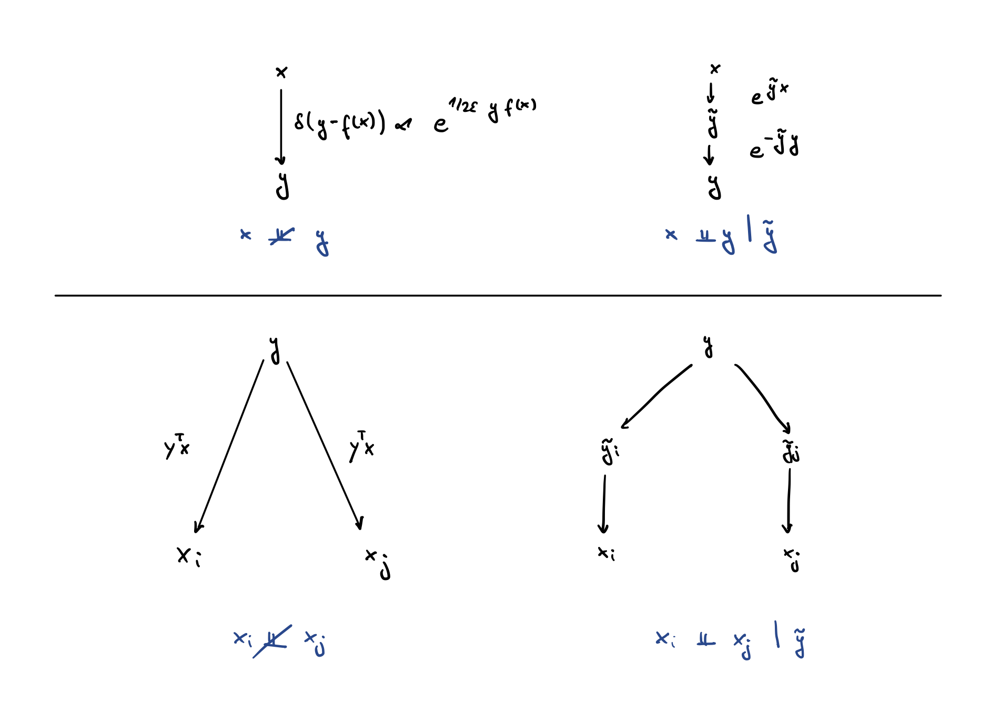

In statistical physics, we are often dealing with systems that comprise many components. In order to calculate their statistics, high-dimensional integrals over those variables $\boldsymbol{x}\in\mathbb{R}^{N}$ with $N\gg1$ are required. A typical form is

$$\mathcal{Z}=\int_{\boldsymbol{x}}e^{S_{\text{0}}(\boldsymbol{x})+S_{V}(\boldsymbol{x})},$$

where we introduced $\int_{x}:=\int_{-\infty}^{\infty}dx$ for brevity.

In general, $S_{V}(\boldsymbol{x})$ couples variables in such a way that the integration does not factorize. If $N$ is small, such integrals would be tractable by numerical methods still, so there no real problem exists. This ceases to be the case in higher dimensions, where the curse of dimensionality manifests. Luckily, there are approximation methods for this case. Mean-field theory is a particular example for this, which will be the subject of this post.\
To illustrate how DMFT can be of help here, let's first consider a toy problem where we just have a single coupled $S_{V}(\boldsymbol{x})$ and set $S_{0}(\boldsymbol{x})=0$, with $$\begin{aligned}
S_{V}(\boldsymbol{x}) & =-\boldsymbol{x}^{T}A\boldsymbol{x}=-x_{i}A_{ij}x_{j}
\end{aligned}$$

where we set $A_{ij}=\delta_{ij}$ for simplicity. This introduces an interaction between variables $x_{i}$ and $x_{j}$ that prevents factorization and the integral from being tractable, i.e. the associated probability density $p(\boldsymbol{x})\propto e^{-x_{i}A_{ij}x_{j}}$ does not factorize. (Note that in the case of a positive definite $A$ the integral is a Gaussian and exactly solvable, but we will still use the approximation for illustration.)

## Decoupling {#decoupling .unnumbered}

To mitigate this, DMFT introduces an **auxiliary field** that caps the threads between $x_{1}$ and $x_{2}$. To accomplish this, we use the identity $$\delta\left(\boldsymbol{y}-\boldsymbol{x}\right)=\int_{\tilde{\boldsymbol{y}}}\,\exp\left(-i\tilde{\boldsymbol{y}}^{T}\left(\boldsymbol{y}-\boldsymbol{x}\right)\right).$$

Further down, we will attempt a more intuitive picture for the identity.

The core procedure goes in two steps: **decoupling** (line 2) and **isolation** (line 4).

$$\begin{aligned}
\mathcal{Z}= & \int_{\boldsymbol{x}}\:e^{-\boldsymbol{x}^{T}A\boldsymbol{x}}\\
= & \int_{\boldsymbol{x}\boldsymbol{y}}\:e^{\boldsymbol{y}^{T}\boldsymbol{y}}\,\delta\left(\boldsymbol{y}-A\boldsymbol{x}\right)\\
= & \int_{\boldsymbol{x}\boldsymbol{y}\tilde{\boldsymbol{y}}}e^{\boldsymbol{y}-i\tilde{\boldsymbol{y}}^{T}\left(\boldsymbol{y}-A\boldsymbol{x}\right)}\,\\
= & \int_{\boldsymbol{y}\tilde{\boldsymbol{y}}}\:e^{-i\tilde{\boldsymbol{y}}^{T}\boldsymbol{y}+\boldsymbol{y}^{T}\boldsymbol{y}}\:\int_{\boldsymbol{x}}\:e^{i\tilde{\boldsymbol{y}}^{T}A\boldsymbol{x}}\\
= & \prod_{i}^{N}\int_{y_{i}\tilde{y}_{i}}\:e^{-i\tilde{y}_{i}y_{i}}\int_{x_{i}}e^{y_{i}y_{i}+i\tilde{y}_{i}x_{i}}\\
= & \left(\int_{y\tilde{y}}\,e^{-i\tilde{y}y+yy}\int_{x}e^{y_{i}y_{i}+i\tilde{y}_{i}x_{i}}\right)^{N}\\
= & \int_{y\tilde{y}}\,\underbrace{e^{-Ni\tilde{y}y}\:e^{N\ln Z_{1}(y,\tilde{y})}}_{=:I(y,\tilde{y})}.
\end{aligned}$$ In the last step, we have identified the **single-site partition function** $Z_{1}$, which apparently goes in as an ingredient to the overall partition function $\mathcal{Z}$. The auxiliary field $\tilde{y}$ describes how those subsystems are coupled to one another.

So far, all manupulations were exact. Unfortunately, to make progress, we now have to introduce an approximation. This is called the **saddle point approximation**, and approximates the integral with the point where the integrand is stationary, $$\begin{aligned}
\partial_{y}I(y^{*},\tilde{y}^{*}) & =0\\
\partial_{\tilde{y}}I(y^{*},\tilde{y}^{*}) & =0.
\end{aligned}$$

Naively, this derives from the intuition that the integrand should be maximal. However, the integral in $\tilde{y}$ is complex, so what is the meaning of the variation with respect to $\tilde{y}$? Looking more closely, this is where the name **stationary phase approximation** becomes more appropriate. Essentially, this picks out the value where the integrand oscillates most slowly, and its values don't average out.

In any case, this gives a set of **saddle point equations of the form $$\begin{aligned}
\tilde{y}^{*} & =\frac{1}{Z_{1}(y,y^{*})}\int_{x}\frac{1}{2}y^{*}e^{S_{0}(x)+\tilde{y}^{*}y^{*}+i\tilde{y}^{*}x}=\frac{1}{2}y^{*}\langle1\rangle_{S_{1}}=\frac{1}{2}y^{*}.\\
y^{*} & =\frac{1}{Z_{1}(y,y^{*})}\int_{x}xe^{S_{0}(x)+\tilde{y}^{*}y^{*}+i\tilde{y}^{*}x}=\langle x\rangle_{S_{1}},
\end{aligned}$$**

where we defined $S_{1}(x;y,\tilde{y})=S_{0}(x)+\tilde{y}^{*}y^{*}+i\tilde{y}^{*}x$.

Note that curiously, $y^{*}$ is the average value of $x$ under this effective, one-dimensional theory $S_{1}.$This reflects that we have decoupled the variables, so that each variable sees an independent distribution $S_{1}$, summarizing the *mean-field* influence of the others.

#### Relation to conditional independence {#relation-to-conditional-independence .unnumbered}

<figure>

<figcaption><strong>Illustration of how auxiliary fields can decouple variables.</strong> Top: <em>δ</em>-coupled theory which can be understood through a soft $\delta(y-f(x))\propto e^{\frac{1}{2\epsilon}yf}$ revealing the interaction in exponential form. Bottom: coupling through <em>e</em><em>x</em><em>T</em><em>A</em><em>x</em> = <em>e</em><em>y</em><em>T</em><em>x</em>.</figcaption>
</figure>

One can point out a relationship to conditional independence here: If we consider a probability $p(x_{i},x_{j})\propto\exp(-x_{i}A_{ij}x_{j})$, the variables are said to be statistically dependent, as the distribution does not factorize. In the context of graphical models, such dependence typically comes about from an unobserved latent confounder, coupling the variables. From the transform above, we can identify $\boldsymbol{y}$ as the confounder that couples the variables through $\boldsymbol{\tilde{y}}.$ Conversely, fixing or observing a value of $(\boldsymbol{y},\boldsymbol{\tilde{y}})$ in the integral makes $x_{i}$ and $x_{j}$ conditionally independent, $p(x_{1},x_{2}|\boldsymbol{y},\tilde{\boldsymbol{y}})=p(x_{1}|\boldsymbol{y},\tilde{\boldsymbol{y}})p(x_{2}|\boldsymbol{y},\tilde{\boldsymbol{y}})$.

After this brief introduction, let's take a look how we can apply this to an actual physical problem.

## Example: Ising model {#example-ising-model .unnumbered}

We can apply the developed formalism to the Ising model. It can be described again in terms of a partition function that depends on a parameter $\boldsymbol{j}$, $$\mathcal{Z}(\boldsymbol{j})=\int_{\boldsymbol{x}}e^{-\boldsymbol{x}^{T}J\boldsymbol{x}+\boldsymbol{j}^{T}\boldsymbol{x}}.$$

Here, the term $\boldsymbol{x}^{T}J\boldsymbol{x}=x_{i}J_{ij}x_{j}$ takes the role of the coupling $A$ between variables we have seen before.

To illustrate the main difficulty and how the mean-field approach can solve it, we will first discuss the ad-hoc approach that is often introduced in undergraduate courses. Afterwards, we will see how this relates to the formal approach developed above.

### Ad-hoc mean-field theory {#ad-hoc-mean-field-theory .unnumbered}

The mean-field approach typically gets introduced in an ad-hoc fashion, in the sense that one replaces the value of each spin in the partition function by its average $\bar{\boldsymbol{x}}$ plus a small fluctuation $\delta\boldsymbol{x}$, merely amounting to a shift of integration variables. Subsequently, one discards quartic terms in $\delta\boldsymbol{x}$, so that we get

$$\mathcal{Z}(j)=\int_{\bar{\boldsymbol{x}}+\delta\boldsymbol{x}}e^{-\bar{\boldsymbol{x}}^{T}J\bar{\boldsymbol{x}}-2\bar{\boldsymbol{x}}^{T}J(\bar{\boldsymbol{x}}+\delta\boldsymbol{x})+\boldsymbol{j}^{T}\left(\bar{\boldsymbol{x}}+\delta\boldsymbol{x}\right)}.$$

This renders the partition function tractable, and we obtain the expectation by the self-consistency condition $$\bar{\boldsymbol{x}}\equiv\langle\bar{\boldsymbol{x}}+\delta\boldsymbol{x}\rangle_{\delta\boldsymbol{x}}=\partial_{\boldsymbol{j}}\ln\mathcal{Z}(\boldsymbol{j})|_{\boldsymbol{j}=0},$$ yielding $$\begin{aligned}
\bar{\boldsymbol{x}} & =\frac{1}{\mathcal{Z}(0)}\int_{\bar{\boldsymbol{x}}+\delta\boldsymbol{x}}e^{-2\bar{x}J(\bar{\boldsymbol{x}}+\delta\boldsymbol{x})}\\
 & =\tanh(-2J\bar{\boldsymbol{x}}).
\end{aligned}$$

This exposes $-2J\bar{\boldsymbol{x}}$ as an **effective mean field** that controls the statistics of $\bar{\boldsymbol{x}}+\delta\boldsymbol{x}$.

### A more formal approach {#a-more-formal-approach .unnumbered}

We can also solve the Ising model by the formal technique developed above. To this end, we again first decouple the action and then identify a field that influences all sites.

We start again from $$\begin{aligned}
\mathcal{Z}(\boldsymbol{j}) & =\int_{\boldsymbol{x}}e^{-\boldsymbol{x}^{T}J\boldsymbol{x}+\boldsymbol{j}^{T}\boldsymbol{x}}\nonumber \\
 & =\int_{\boldsymbol{y}\tilde{\boldsymbol{y}}}\:\int_{\boldsymbol{x}}e^{-\boldsymbol{x}^{T}\boldsymbol{y}-i\tilde{\boldsymbol{y}}^{T}(\boldsymbol{y}-J\boldsymbol{x})+\boldsymbol{j}^{T}\boldsymbol{x}}\nonumber \\
 & =\int_{\boldsymbol{y}\tilde{\boldsymbol{y}}}e^{-i\tilde{\boldsymbol{y}}^{T}\boldsymbol{y}}\:\int_{\boldsymbol{x}}e^{-\boldsymbol{x}^{T}\boldsymbol{y}+i\tilde{\boldsymbol{y}}^{T}J\boldsymbol{x}+\boldsymbol{j}^{T}\boldsymbol{x}}.\label{eq:isolated-ising}
\end{aligned}$$

Again, we decoupled **via** $\boldsymbol{y}:=J\boldsymbol{x}$ in line 2. Unfortunately, we cannot yet decouple the later integrand, as $J\boldsymbol{x}=J_{ij}x_{j}$ mixes the variables. To move forward, we have introduce one more trick:

### Averaging over the quenched disorder {#averaging-over-the-quenched-disorder .unnumbered}

If a problem is too hard, it makes sense to try solving an approximate version of it. In statistical physics, this usually means trading exact results for a statistical answer, in other words: **ignoring microscopical details of the system**. Practically, this means that we say that we only know $J$ up to its statistics, and hence are interested in answers **in expectation** over them.

It is common to assuming that its entries are identically, independently, and Gaussian distributed, $$J_{ij}\sim\mathcal{N}\left(0,\,\sigma^{2}/N\right),$$

an assumption that is backed partially by the central limit theorem and partially by reasons of analytical convenience.

With this, we can approach the $J$-dependent term by analytically solving a multivariate Gaussian integral $$\begin{aligned}
 & \langle e^{i\tilde{\boldsymbol{y}}^{T}J\boldsymbol{x}}\rangle_{J_{ij}\sim\mathcal{N}(0,\sigma^{2}/N)}\\
= & \langle e^{i\tilde{\boldsymbol{y}}^{T}\boldsymbol{J}}\rangle_{J_{i}\sim\mathcal{N}(0,x_{i}^{2}\sigma^{2}/N)}\\
= & e^{-\frac{1}{2}\sigma^{2}/Nx_{i}^{2}\tilde{y}_{i}^{2}},
\end{aligned}$$ which is called the **Hubbard-Stratonovich trick**.

This finally allows us to decouple

$$\begin{aligned}
\langle\mathcal{Z}(\boldsymbol{j})\rangle_{J} & =\int_{\boldsymbol{y}\tilde{\boldsymbol{y}}}\,e^{-i\tilde{\boldsymbol{y}}^{T}\boldsymbol{y}}\:\int_{\boldsymbol{x}}e^{-\boldsymbol{x}^{T}\boldsymbol{y}+i\tilde{\boldsymbol{y}}^{T}J\boldsymbol{x}+\boldsymbol{j^{T}}\boldsymbol{x}}\\
 & =\int_{\boldsymbol{y}\tilde{\boldsymbol{y}}}\,e^{-i\tilde{\boldsymbol{y}}^{T}\boldsymbol{y}}\:\prod_{i}^{N}\int dx_{i}e^{-x_{i}y_{i}-\tilde{y}_{i}^{2}\sigma^{2}/Nx_{i}^{2}+j_{i}x_{i}}\\
 & =\int_{y\tilde{y}}\,e^{-Ni\tilde{y}y}\:e^{N\ln Z_{1}(y,\tilde{y})}.
\end{aligned}$$

In the last line, we have again identified the single site partition function. Finally, we perform the saddle point approximation. After taking the derivative, we discard the subleading term $\propto\sigma^{2}/N$, and get $$\begin{aligned}
\tilde{y}^{*} & =\frac{1}{Z_{1}(y^{*},\tilde{y}^{*})}\int_{x}\,-x\,e^{-xy^{*}+jx}=\langle-x\rangle_{S_{1}}\\
y^{*} & =\frac{1}{Z_{1}(y^{*},\tilde{y}^{*})}\int_{x}\,-2\tilde{y}\sigma^{2}/Nx^{2}\,e^{-xy^{*}+jx}\\
 & =\frac{1}{Z_{1}(y^{*},\tilde{y}^{*})}\int_{x}\,2\langle x\rangle_{S_{1}}\left(J\boldsymbol{x}\right)^{2}e^{-xy^{*}+jx}\\
 & =2\langle x\rangle_{S_{1}}\sigma^{2}/N\langle x^{2}\rangle_{S_{1}}.
\end{aligned}$$

Recalling the introduction of $\boldsymbol{y}$ as $\boldsymbol{y}=J\boldsymbol{x}$, we can make sense of this $$y_{i}=J_{ij}x_{j}=J_{ij}\left(J_{jk}x_{k}J_{jl}x_{l}\right)=\sigma^{2}x^{2}$$

Equivalently, we can write the last equation as $$y^{*}=\cosh^{-2}(\sigma^{2}y^{*}).$$

Plugging in this solution into the integral, we end up with $$\begin{aligned}
\langle\mathcal{Z}(j)\rangle_{J,\,\text{MF}} & =\left(\int_{x}e^{-xy^{*}+jx}\right)^{N}\\
 & =\left(2\cosh\left(-y^{*}+j\right)\right)^{N}.
\end{aligned}$$

From this, we can see that $y^{*}$ naturally appears as a field influencing the statistics of $x$. In particular, we get $$\bar{x}=\partial_{j}\ln\langle Z(j)\rangle_{J,\,\text{MF}}|_{j=0}=\tanh(-y^{*}).$$

## Advanced MFT cookbook {#advanced-mft-cookbook .unnumbered}

When tackling more complicated problems, there are a couple of identities that can take a large part of the way in decoupling an integral. These are

### $e^{-\frac{1}{2}y\sigma^{2}y}=\frac{1}{\left(2\pi\sigma^{2}\right)^{1/2}}\int_{\tilde{y}}e^{-\frac{1}{2}\frac{1}{\sigma^{2}}\tilde{y}^{2}+i\tilde{y}y}$ decoupling (Hubbard-Stratonovich transform) {#e-frac12ysigma2yfrac1left2pisigma2right12int_tildeye-frac12frac1sigma2tildey2itildeyy-decoupling-hubbard-stratonovich-transform .unnumbered}

$$\langle e^{iy^{T}\tilde{y}}\rangle_{\tilde{y}\sim\mathcal{N}(0,A)}:=\frac{1}{\left(2\pi\det A\right)^{d/2}}\int d\tilde{y}\,e^{-\frac{1}{2}\tilde{y}^{T}A^{-1}\tilde{y}+iy^{T}\tilde{y}}\equiv e^{-\frac{1}{2}y^{T}Ay}.$$

$$\langle e^{iy^{T}\tilde{y}}\rangle_{\tilde{y}\sim\mathcal{N}(0,\,A)}=e^{-\frac{1}{2}y^{T}Ay}$$

(Note that this can be seen from the general definition of **cumulant generating functions** $W(j)$ $$\langle e^{jx}\rangle=Z(j)=:e^{W(j)},$$

which for $y\sim\mathcal{N}(0,\,A)$ precisely gives $$\langle e^{jx}\rangle=\frac{1}{\sqrt{|2\pi\Sigma|}}\int_{x}e^{-\frac{1}{2}xA^{-1}x}\,e^{jx}=e^{\frac{1}{2}j\Sigma j}.$$

Note that this in this case is **just the Fourier transform of the Gaussian**, where we know that the variance inverts.

This trick can be especially useful to get rid of the inverse $A^{-1}$ at the cost of introducing an integral. To remember the workings of this formula, note that the integrating exchanges $x$ for $y$ in the Gaussian, removes the linearity and inverts the variance. )

As a special case, we can take the denominator to the other side and get with $A\rightarrow0$ and get $$\frac{1}{\sqrt{|2\pi A|}}e^{-\frac{1}{2}y^{T}A^{-1}y}\rightarrow\delta(y)=\int d\tilde{y}\,e^{iy^{T}\tilde{y}},$$

recovering the characterization of the $\delta$-function.

### $\delta(y)=\int_{\tilde{y}}e^{i\tilde{y}y}$ decoupling {#deltayint_tildeyeitildeyy-decoupling .unnumbered}

The Hubbard-Stratonovich transform is useful to decouple quadratically coupled variables, or to trade a matrix inversion for an integral. However, not all interactions $S_{V}(x)=y(x)$ can be solved this easily. Using the $\delta$-identity, we can still formally decouple the integral:

$$\begin{aligned}
 & \int dx\,e^{S_{0}(x)+y(x)}\\
= & \int dx\int dy\,e^{S_{0}(x)+y}\,\delta(y-y(x))\\
= & \int dx\int dy\int d\tilde{y}\,e^{S_{0}(x)+i\tilde{y}(y-y(x))}\\
= & \int dy\int d\tilde{y}\,e^{i\tilde{y}y}C(\tilde{y}).
\end{aligned}$$

Using this, it is for example possible to derive the Fourier transform of a Gaussian, using the constraint $y\overset{!}{=}y(x)=A^{-1}x$, thus recovering the Hubbard-Stratonovich identity,

$$\begin{aligned}
e^{-\frac{1}{2}x^{T}A^{-1}x} & =\int dy\,e^{-\frac{1}{2}y^{T}Ay}\,\delta(y-A^{-1}x)\\
 & =\int dyd\tilde{y}\,e^{-\frac{1}{2}y{}^{T}Ay+i\tilde{y}\left(y-A^{-1}x\right)}\\
 & =\int d\tilde{y}\,e^{-\frac{1}{2}\tilde{y}^{T}A^{-1}\tilde{y}-i\tilde{y}A^{-1}x}\\
\tilde{y}\rightarrow A\tilde{y}\: & =\int d\tilde{y}\,e^{-\frac{1}{2}\tilde{y}^{T}A\tilde{y}-i\tilde{y}x},
\end{aligned}$$

where we did a transformation of variables in the last step.\
Finally, it is interesting to see how these two approaches relate: Any hard $\delta$-constraint may be implemented as a smooth "relaxation" via a Hubbard-Stratonovich transform: $$\begin{aligned}
 & \int dx\int dy\,e^{S_{0}(x)+y(x)}\,\delta_{\sigma}(y-y(x))\\
= & \int dx\int dy\,e^{-\frac{1}{2\sigma^{2}}(y-y(x))^{2}}\\
\overset{\text{H.S.}}{=} & \int dx\int dy\int d\tilde{y}\,e^{-\frac{1}{2}\sigma^{2}\tilde{y}^{2}+i\tilde{y}(y-y(x))}\\
= & \int dy\int d\tilde{y}\,e^{-\frac{1}{2}\sigma^{2}\tilde{y}^{2}+i\tilde{y}y}\,C(\tilde{y}).
\end{aligned}$$

The first term becomes approximately constant as we take the limit $\sigma\rightarrow0$, approximating the $\delta$-function.

### Relation to Lagrange multipliers {#relation-to-lagrange-multipliers .unnumbered}

Suppose we strive to optimize a function $\mathcal{L}(x)$ under a constraint $y(x)=0$. The method of Lagrange multipliers solves this problem by introducing dummy parameter $\tilde{y}$. Then, an augmented objective is to be minimized $$\tilde{\mathcal{L}}(x;\tilde{y})=\mathcal{L}(x)+\tilde{y}y(x)$$

by requiring $\partial_{x}\tilde{\mathcal{L}}(x^{\star};\tilde{y}^{\star})=0$ and $\partial_{\tilde{y}}\tilde{\mathcal{L}}(x^{\star};\tilde{y}^{\star})=0$. The second condition by construction amounts to fulfilling the constraint. There is however a caveat that we will dig into below.

How does this relate to our former method? Let us rewrite the objective as an integral by superimposing all possible solutions, $$\int dx\,e^{-\mathcal{L}(x)}\,\delta(y(x)-0).$$

We can apparently reframe the problem as finding the $x$ that maximizes the integrand. I(It will become clear in a moment while it is useful to exponentiate the loss. )To this end, let's again raise the $\delta$-constraint, $$\int dx\int d\tilde{y}\,e^{-\mathcal{L}(x)+i\tilde{y}\left(y(x)-0\right)}=:\int dx\int d\tilde{y}\,e^{-\tilde{\mathcal{L}}(x)}.$$

At this point, we can look for the point that maximizes the integrand. This leads to saddle-point equations $$\begin{aligned}
\partial_{x}\tilde{\mathcal{L}}(x^{\star};\tilde{y}^{\star}) & =0\\
\partial_{\tilde{y}}\tilde{\mathcal{L}}(x^{\star};\tilde{y}^{\star}) & =0.
\end{aligned}$$

This is precisely the prescription of the Lagrange paradigm! The Lagrange multiplier can hence be thought of as an auxiliary field in disguise that penalizes the objective's values to comply with the constraint. Crucially however, we have no guarantee that the saddle point equations have a solution.

This perhaps also reveals that an optimization via Lagrange multipliers may not have a solution. What to do then? We could employ a Gaussian $\delta_{\sigma}$-relaxation, which will ensure that an optimum exists. This allows for slightly (according to $\sigma$) violating the constraint until a minimum exists.

### Effective action {#effective-action .unnumbered}

Suppose we have an action $$Z(0)=\int_{x}e^{S(x)}$$

We now assume that it is self-averaging, i.e. it concentrates around its mean $x^{*}$. Then, we can rewrite $$\begin{aligned}
Z(0) & \simeq\int_{x}e^{S(x)}\,\delta(x-x^{*})\\
 & =\int_{x\tilde{x}}e^{S(x)+\tilde{x}(x-x^{*})}\\
 & =\int_{x\tilde{x}}e^{S(x)+\tilde{x}(x-x^{*})}\\
\text{sup}_{\tilde{x}}\rightarrow & \simeq e^{-\tilde{x}x^{*}}\int_{x}e^{S(x)+\tilde{x}x}\\
 & =e^{-\tilde{x}x^{*}}e^{W(\tilde{x})}\\
 & =e^{-\Gamma(x^{*})}.
\end{aligned}$$

where we took the $x$-independent $\text{sup}_{\tilde{x}}$ using that the integrand concentrates in $x$.

So for self-averaging theories, we can find the likelihood of $x^{*}$ if we have access to the Legendre transform $\Gamma(x^{*})=\sup_{\tilde{x}}\tilde{x}x-W(\tilde{x})$.If we somehow have access to $\Gamma$, this avoids having to evaluate the intractable integral for $Z$. It can also be shown more generally (Helias and Dahmen, 2019) that the effective action contains only non-redundant terms. It is possible to get systematic perturbative expansions in $\Gamma$, which is necessary for most real cases (Kuehn 2018).
