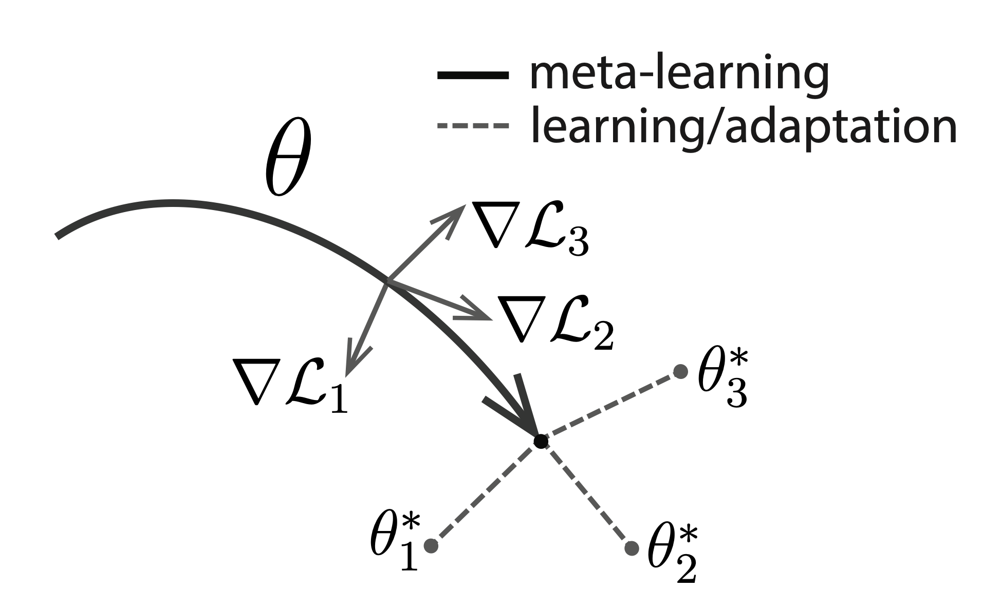
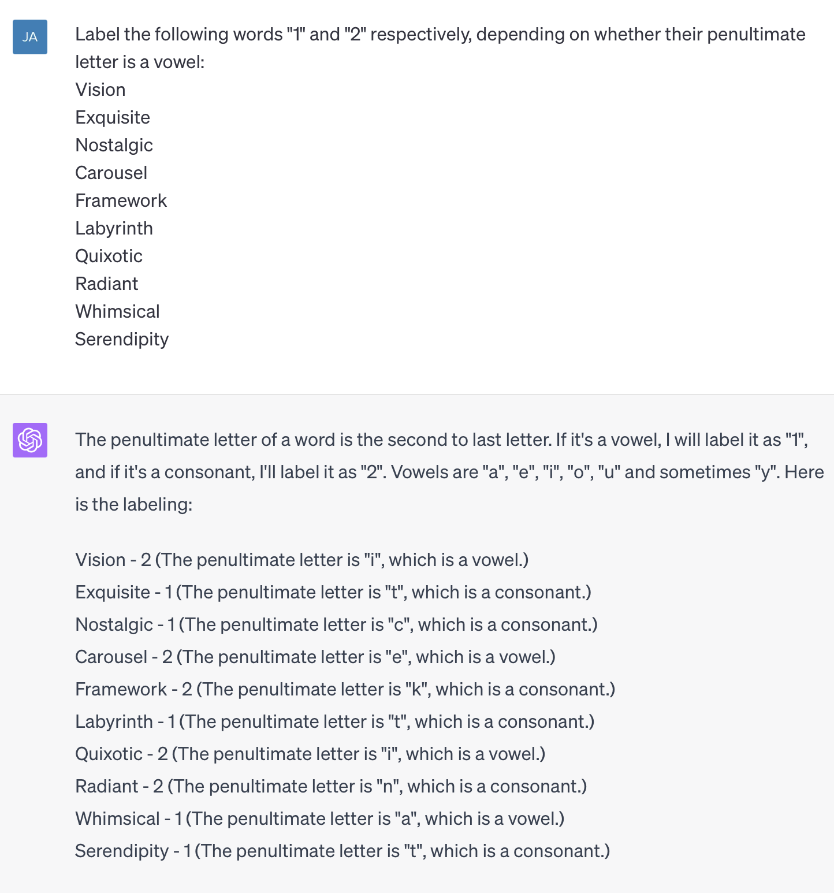

There is a saying: "Give a man a fish, and you feed him for a day. Teach a man to fish, and you feed him for a lifetime." What folklore refers to here is immediately clear: In adapting skills from tutors, individuals will be able to ensure their survival. In learning *how* to fish, the man will likely be able to feed himself for days to come.

In artificial intelligence, **meta-learning** has become knwon as an extension to this paradigm, often referred to as "learning to learn". In our colloquial example, one might think of the fisherman's apprentice as being unknownledgable about fishing, but curious, equipped with a camera and a Swiss army knife, so that he will be ready to absorb the knowledge and repeat his mentor's actions.

In this blogpost, we will try to distill a more formal notion about different kinds of learning in the context of machine learning.\
What would be a useful **definition of learning**? Tutorship has been successful if an individual is able to apply the gained knowledge independently, that is to situations that it wasn't exposed to during training. Quite generally, action can be phrased as getting the right output on a given input. Therefore, we introduce a set of training examples $X$ and the correct outputs $Y$, and make learning the task of inferring the right output $y^{\star}$ on an unseen input $x^{\ast}$.

Let $f=\mathcal{T}\left[\emptyset,\left(X,Y\right)\right]$ be a learned function from scratch from $\left(X,Y\right)$, where $\mathcal{T}:\left(X,Y\right)\mapsto f$ is a "training" operator that turns data $\left(X,Y\right)$ into functions $f$. While it can be defined purely abstractly, it in practice needs to be implemented. This is usually done by employing a model $\mathcal{M}$, and highly dependent on the inductive biases that come with it. Notably, in the machine learning setting, this includes architecture and the optimization procedure, where the latter is influenced by algorithm (ADAM, SGD,\...) and hyperparameters (learning rate): 

$$\mathcal{T}=\mathcal{T}_{\mathcal{M}}\overset{\text{e.g.}}{=}\mathcal{T}_{\left(\text{CNN},\text{ADAM}\text{lr}=01 N_{\text{epoch}}=42\right)}.$$

Note that we here did not introduce any parameters. Yet, we can implement a $\mathcal{T}$ by using a *parametric model*, that is starting from some parameter set $\theta$ and determining an optimal $\theta^{\star}$ according to some metric.

How does **meta-learning** now fit into this picture? It corresponds to finding a good setup to conduct the learning, potentially depending on the task at hand. We can hence view it as a meta-operator $$\mathcal{\tilde{T}}:(\tilde{X}=\left(\text{task},\text{model}\mathcal{M}\right),\tilde{Y}=\text{performance})\mapsto\tilde{f}.$$ Provided the performance of some models on some tasks, it outputs a strategy $\tilde{f}\left(\tilde{x}^{\ast}=(\text{task}^{\ast},\text{model}\mathcal{M^{\ast}})\right)$ that predicts the performance $\tilde{y}^{\ast}$ of $\mathcal{M^{\ast}}$ on some unseen $\text{task}^{\ast}$. This for example can then be used to assess the prospects of hyperparameters before the potentially costly training run. Again, we did not talk about how to implement this, but we could again parametrize $\tilde{f}=\tilde{f}_{\Omega}$ and for example run a gradient-based optimization on $\Omega$.

Connecting it back to the notion of meta-learning that we introduced first, the past experience of apprenticeships at a carpenter, scholar and soldier might have taught our apprentice that a useful model for the being tutored by the practically oriented fisher will not necessarily include a notepad, but rather $$\mathcal{M}=\left(\text{camera},\text{Swiss army knife},\text{patience}\right).$$

There is the concept of **transfer learning**, often called **few-shot learning, continual learning, or fine-tuning**. It is about improving a previously found $f$ by novel "fine-tuning" information $\left(X^{+},Y^{+}\right)$ by means of some update procedure $f^{+}=\mathcal{U}[f,\left(X^{+},Y^{+}\right)]$. By consistency, we would like $$\mathcal{U}\left[f,\left(X^{+},Y^{+}\right)\right]=\mathcal{T}\left[\emptyset,\left(X,X^{+},Y,Y^{+}\right)\right],$$

that is that it shouldn't matter whether we update an $f$ incrementally, or would have digested all available evidence upfront. Note that probabilistic models such as Gaussian processes that have no notion of training time naturally fulfill this consistency requirement. On the other hand, any $\mathcal{T}$ that would not fulfill this can be said to have **overfitted**.

Finn17 discuss the notion of transfer learning in the context of $\theta$-parametrized models, such as neural networks. In their view, a good transfer learner corresponds to finding a good "outlook-spot" $\theta^{\ast}$ from which new information, even be it somewhat unexpected, can be gracefully incorporated. This typically requires only a small change in $\theta$.

<figure>

<figcaption>Model-agnostic meta learning of Finn17.</figcaption>
</figure>

Note that fine-tuning such a $\theta^{\ast}\rightarrow\theta^{+,1},\theta^{+,2},\ldots$ is not strictly necessary in order to have a model transfer learn. We can restate Finn17's finding about transfer learning in the meta-learning framework, by reading it as a specific local statement about the nature of the model selection function $\tilde{f}$: For any task, there exist desirable "outlook" parameters $\theta^{\ast}$ such that adjacent tasks will have high performance for adjacent models. Formally, this would read something like 

$$\forall\text{task}\exists\mathcal{M_{\theta^{\ast}}}\forall\text{dtask}\exists d\theta:\tilde{f}(\text{task}+\text{dtask},\mathcal{M}_{\theta^{\ast}+d\theta})=\text{high}.$$

Put differently yet again, a good model selection strategy for NNs is to look for NNs pretrained on similar tasks, and only do incremental updates.

Note that transfer learning can happen without the need for parameter updates. An example might be LLMs. In what is below, we prompt the model to solve our extended task, and it does so without changing its parameters.

<figure>
<ul>
<li></li>
</ul>
<figcaption>An LLM transfer learns without a parameter update.</figcaption>
</figure>

Relating this back to the fisher's apprentice, he or she would be *quickly* learn how to catch wild animals by *tranferring* the skills learnt from the fisher, with the having to be tutored only very briefly by the hunter.\
Lastly, we can ask how this relates to **generalization**. Generalization ability is about finding the right inductive bias, i.e. the question of choosing the right $\mathcal{T_{\mathcal{M}}}$ for a given task upfront. That is, for as many unseen inputs $x^{\ast}$, it should hold that 

$$
\mathcal{T}_{\mathcal{M}} \left(f,\left(X,Y\right) \right)(x^{\ast}) =y^{\star}(x^{\ast}).
$$

If $x^{\ast}$ is quite different in some sense (possibly semantically), this is sometimes termed *extrapolation* (as opposed to *interpolation*) or *out-of-distribution learning*.

Choosing $\mathcal{M}$ correctly is typically based on experience, for example by having gone through a meta-learning procedure as defined above. As it turns out, choosing $$\mathcal{M}=\left(\text{veryverylarge NN},\text{SGD}\right)$$

comprises a very versatile $\mathcal{T_{\mathcal{M}}}$, working on many different tasks. An apprentice that carries a lot of tools and is curious will be a very able learner.\
In conclusion, **meta-learning**, **transfer learning** and **generalization** are intimidly related: Good, even "out-of-distribution" generalization can be achieved by having chosen the right model $\mathcal{M}$, possibly by help of a meta-learning scheme. Transfer learning, in constrast, learns how to handle novel input by incorporating *new* training data in an efficient manner.
